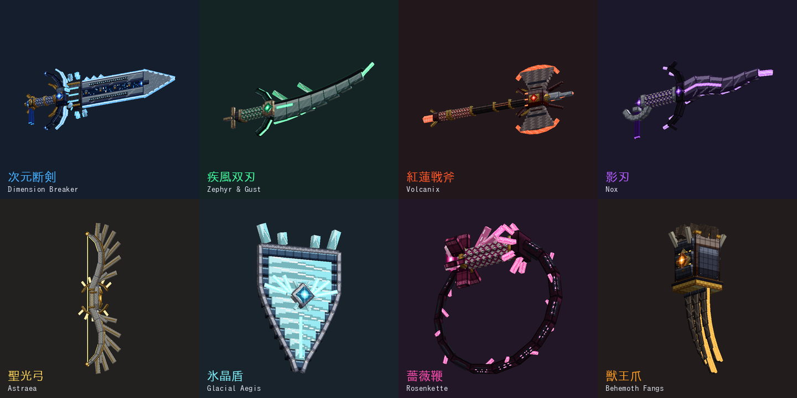

# 超次元バトルアーツ (Hyper Dimension Arts)

Minecraft **統合版 (Bedrock Edition)** 用のオリジナル・アニメ風 **PvP アドオン**です。
8 種の「超次元武器」に、三段コンボ・戦技・突進技・空中技・必殺技（カットイン付き）と、
二段ジャンプ・空中ダッシュ・回避ステップといったアクションゲームの機動を付けます。



- 対応バージョン: **Minecraft Bedrock 1.21.30 以降**
- 使用 API: `@minecraft/server 1.13.0`（安定版。ベータ API の ON は不要）/ `@minecraft/server-ui 1.2.0`
- 言語: 日本語 / English

---

## 導入

1. `dist/HyperDimensionArts_v1.0.0.mcaddon` を開いて Minecraft に取り込む
2. ワールド設定で **ビヘイビアーパック** と **リソースパック** の両方を有効化
3. 初回参加時に **超次元指南書** が配られます（右クリックで操作と全技の一覧）

すぐ試すなら（チート ON のワールドで）:

```
/scriptevent hd:kit      武器 8 種と指南書を一式もらう
/scriptevent hd:dummy    目の前に訓練用カカシを出す（倒れない・DPS 表示）
/scriptevent hd:gauge    超次元ゲージを満タンにする（必殺技の確認用）
/scriptevent hd:guide    指南書を開く
```

---

## 操作

| 操作 | 効果 |
|---|---|
| 攻撃（左クリック） | 当てるたびに **1→2→3 段目**のコンボ（1.3 秒あくと 1 段目へ）。段ごとに全身の振りと斬撃の向きが変わり、**三段目は武器ごとの追撃** |
| 右クリック | **戦技** |
| ダッシュ中に右クリック | **突進技** |
| 空中で右クリック | **空中技** |
| スニーク＋右クリック | **必殺技**（超次元ゲージ 100% で発動。カットイン・画面フラッシュ・周囲の敵の時間停止） |

### 機動（超次元武器を持っている間）

| 操作 | 効果 |
|---|---|
| 空中でジャンプ | **二段ジャンプ**（双剣・ダガー・かぎ爪は三段）。宙返りのモーションと足元の魔法陣 |
| 空中でスニーク | **空中ダッシュ**（残像とスピードライン） |
| 地上でスニークを素早く 2 回 | **回避ステップ**。移動中はその方向へ、止まっていれば後ろへ。直後 0.4 秒は無敵 |
| 武器を持ってダッシュ | 加速（軽い武器ほど速い）＋足元に属性色の風 |
| 高所から着地 | 片膝をつく**ヒーロー着地**と衝撃の輪。技や機動で跳んだ後の**落下ダメージは無効** |

### 超次元ゲージ

攻撃を当てる・被弾する・ジャストガードで溜まります。HUD（アクションバー）に
武器名・コンボ数・ゲージ・4 種の技の再使用時間が出て、満タンになると金と白が流れ、
「★ 必殺技 READY ★」の表示と効果音で知らせます。必殺技の最中は溜まりません。

---

## 武器と技

| 武器 | 属性 | 戦技（右クリック） | 突進技（ダッシュ中） | 空中技 | 必殺技（スニーク＋右クリック） |
|---|---|---|---|---|---|
| **次元断剣 ディメンション・ブレイカー**（大剣） | 蒼・次元 | 「次元断」溜めて振り下ろし、次元の裂け目が 12m 先まで地を這う | 「流星突」切先を突き出して駆け抜け、最後に炸裂 | 「天墜」宙で止まり真下へ叩きつけ、次元の柱を 6 本 | 「終焉次元斬・アポカリプス」時を止め、空間ごと七度断ち、天から斬り落とす |
| **疾風双刃 ゼファー＆ガスト**（双剣） | 翠・風 | 「疾風連刃」左右の六連から十字で吹き飛ばす | 「旋風斬」竜巻をまとって回転しながら駆け抜ける | 「燕返し」前の敵へ急降下して十字斬り、宙返りで離脱 | 「千刃嵐舞・テンペスト」敵の間を風になって渡り斬り、竜巻で締める |
| **紅蓮戦斧 ヴォルカニクス**（両手斧） | 紅・炎 | 「爆炎断」振り下ろした先で溶岩が三度噴き上がる | 「炎輪旋」炎の輪をまとって回転前進 | 「隕鉄落」隕石のように落ちてクレーターを作る | 「紅蓮獄炎・ヴォルカニック・エンド」五つの火口が噴き、最後に大地が爆ぜる |
| **影刃 ノクス**（ダガー・逆手） | 紫・影 | 「影縫い」影の苦無を扇に三本。刺さると縫い止め | 「瞬影」前方の敵の背後へ瞬間移動して背中を斬る（敵がいなければ瞬身） | 「影落とし」回転落下し、影の刃を八方へ | 「冥夜幻葬・ノクターン」夜に溶けて八方から斬り、紫の月で葬る |
| **聖光弓 アストライア**（弓） | 金・光 | 「聖光矢」引き絞って放つ。溜め 0.4 秒で LV1（貫通）、1 秒で LV2（三本の貫通矢） | 「宙返り三連射」ダッシュ中に引くと後方宙返りしながら扇射ち | 「星雨」空中で放つと、狙った地点に陣を描き光の矢を降らせる | 「天穹神弓・ジャッジメント」神弓の陣から極太の光線（壁で止まる） |
| **氷晶盾 グレイシャル・イージス**（盾） | 氷 | **右クリック中ガード**（被ダメージ 60% 減）。構えた直後 0.3 秒は**ジャストガード**（無傷＋相手を凍結して弾く）。離すと受けた衝撃を「氷撃反射」で返す | 「氷河突撃」盾を前に突進、弾き飛ばして凍結 | 「氷槌」叩きつけて氷の棘を二重の輪で | 「絶対氷壁・アブソリュート・イージス」氷の結界で身を守り、内の敵を凍らせて砕く |
| **薔薇鞭 ローゼンケッテ**（鞭） | 薔薇 | 「茨の鞭」9m 先まで届く二連の鞭打ち（出血） | 「薔薇の鎖」敵を引き寄せる。敵がいなければ**壁や地面へ飛び移るグラップル** | 「薔薇旋風」宙で鞭を振り回し、周り 5m を刻む | 「千薔薇葬送・ブラッディ・ローズ」薔薇の陣で敵を縛り、命を吸う |
| **獣王爪 ベヒモス**（両手かぎ爪） | 琥珀・獣 | 「獣王連爪」左右の四連撃から大十字 | 「猛獣突進」弧を描いて跳びかかり組み伏せる | 「天裂爪」斬り上げで自分も敵も打ち上げる | 「獣神解放・ベヒモス・ロア」咆哮で薙ぎ払い、一体に十二連の乱撃 |

通常攻撃の三段目の追撃: 大剣は衝撃波、双剣は十字と風、斧は足元からの噴火と炎上、ダガーは
**背後から当てると会心（+4）**、弓は光の炸裂、盾は凍結、鞭は毒の棘、かぎ爪は X の爪痕と打ち上げ。

### レシピ

まず **次元結晶**（アメジストの欠片 ×2＋ダイヤモンド＋エンダーパール → 2 個）を作り、
それと各武器の属性素材（大剣: ダイヤモンドブロック＋ブレイズロッド、双剣: 羽、斧: マグマブロック、
ダガー: エンダーパール、弓: 金インゴット、盾: 氷塊、鞭: ツタ＋バラの低木、かぎ爪: 鉄ブロック＋革）で
作業台から作ります。武器は次元結晶で修理できます。

---

## 作り込み

### 3D モデル

武器はすべてキューブを積んだ立体モデル（46〜192 キューブ）で、刃・鍔・柄巻・宝玉まで個別の
部品です。斜めの刃先や曲線（弓のリム、反った双剣、斧の三日月、爪の反り）は、2 点間に回転した
角柱を渡す `beam()` と、三角形を平行な角柱で埋める `fill_tri_yz()` で作っています。

| 武器 | 見どころ |
|---|---|
| 大剣 | 二枚刃の間を走る**次元の裂け目**（星が光る）、刃に刻んだ発光ルーン、後ろへ流れる翼の鍔、**鍔元で回り続ける浮遊リング**、風に揺れる房飾り |
| 双剣 | 7 節で反った片刃、三日月の鍔、峰の風切り羽。左右一対で、左手側は左手に持つ |
| 両手斧 | 根元が細く外へ開く三日月の双刃、溶岩炉の芯と放熱口、槍穂と石突き |
| ダガー | 波打つクリス刃、蝙蝠の翼の鍔、三日月の柄頭、影の飾り紐 |
| 弓 | 6 枚の風切り羽が付いた天使の翼のリム、太陽の光輪。**引くとリムが撓み、弦が下がり、光の矢が現れる** |
| 盾 | カイト型の段積み、銀の縁、氷の棘、放射状の氷の羽、**脈動して回る氷晶の核**。ガード時は正面へ構え直す |
| 鞭 | 薔薇の花の柄頭、棘の鍔、**14 節の茨の鎖（親子のボーン）**。普段はとぐろを巻いて揺れ、振るとしなって伸びる |
| かぎ爪 | 前腕を覆う篭手と重ね装甲、琥珀の核と牙の飾り、手首の獣毛、拳の先から反る 3 本の爪。両手に装着 |

テクスチャは**アニメ調のセル塗り**（明・中・暗の 3 階調＋輪郭線）で、刃は斜めの映り込み、金具は
菱形の彫り、柄は組紐、宝玉はファセット、そして刃先・ルーン・裂け目・宝玉は**自己発光**します
（`entity_emissive_alpha`: アルファを下げた texel が光る）。アイテムアイコンも 3D モデルから
焼いています。

### エフェクト

* **パーティクル 41 種**（スプライト 32 種）: 斬撃の三日月（先端が太く尾が細い）、十字閃、
  爪痕、衝撃の放射、魔法陣 2 種、六角の結界、雷、次元の亀裂、月、残像のシルエット、
  炎のパラパラ、羽根、花弁、雪、竜巻（螺旋運動）、収束、周回、立ち昇る闘気、
  そして必殺技の決めに出る**一文字の漢字「斬・撃・破・滅・絶」**。
  すべて白で描き、色・大きさ・寿命・回転をスクリプトから渡すので、同じ形が武器の属性色で光ります。
* 斬撃は平面スプライトだけでなく、**3D 空間に円弧状の光の粒を並べた軌跡**で振り抜く向きまで出ます。
* **効果音 22 種を合成**（素材音源なし）: 風切り（軽・重）、斬撃の金属音、重い打撃、ダッシュ、
  ジャンプ、溜め、必殺技のカットイン、爆発、光線、矢、ガード、ジャストガード、雷、炎、風、影、
  鞭、獣の咆哮、氷の砕ける音、ゲージ満タンの合図。各音 1〜3 種の揺らぎ付き。
* 画面揺れ（camerashake）、色付きフラッシュ（camera fade）、**必殺技のカットイン**
  （技名と英名を大きく表示。周りのプレイヤーにも誰が撃ったかが見える）、**浮かび上がるダメージ数字**
  （会心は赤）。

### アニメーション

* **プレイヤーの全身モーション 34 本**（`playanimation` で再生。player.entity.json は上書きしない
  ので他のアドオンと競合しにくい）: 三連コンボ、横薙ぎ・逆薙ぎ・兜割り、突き、斬り上げ、
  回転斬り、溜めからの叩きつけ、突進、急降下、ヒーロー着地、投擲、連撃、弓を引く構え、
  盾の構え、頭上で鞭を回す、必殺技の掲げ・振り下ろし・咆哮・詠唱、ダッシュ、回避、
  **重心まわりの宙返り（前・後ろ）**、両手持ち／獣の構え。一人称では腕の振りを 25% に抑えます。
* **武器側のアニメーション 35 本**: 持ち位置（三人称／一人称）、浮遊リングの回転、房飾りの揺れ、
  盾の核の脈動、鞭のとぐろ、振り、使用中（弓の引き絞り・盾のガード・鞭のしなり・近接武器の溜め構え）。

---

## 対人戦まわりの仕組み

* **ダメージバンク**: Minecraft は被弾後およそ 0.5 秒無敵になるため、技の多段ヒットを
  そのまま入れると大半が消えます。通らなかった分を相手ごとに貯め、無敵が切れた瞬間にまとめて
  通すので、手数の多い技でも見た目どおりの総ダメージが入ります。
* 技の当たりは扇形・線分・円で判定し、同じ技で同じ相手に当たる回数を技ごとに制限しています。
* クリエイティブ／スペクテイターのプレイヤーと、自分が手懐けたペットには当たりません。
* 一度に出すパーティクル数に上限（1 tick 260 個）があり、技が重なってもクライアントが詰まりません。
* **訓練用カカシ**（スポーンエッグあり）: 倒れず、直近 5 秒の与ダメージ合計と DPS を頭上に表示。
  被弾で揺れます。

---

## 開発者向け

モデル・テクスチャ・アニメーション・パーティクル・効果音・アイコン・パックのデータは
すべて `tools/hyperdim/` の Python から**生成**されます。`packs/hyperdim_*` の生成物を直接
編集せず、生成スクリプトを直して再ビルドしてください（スクリプト `packs/hyperdim_BP/scripts/` は手書き）。

```bash
./build_hyperdim.sh                              # 生成 → 挙動テスト → 参照検証 → dist/ へ
python3 tools/hyperdim/test_hd.py                # 全 32 技・コンボ・機動・弓の溜め・盾を偽プレイヤーで実行
python3 tools/hyperdim/validate_hd.py            # 参照切れ・UV のはみ出し・Molang の括弧
HD_PREVIEW=1 python3 tools/hyperdim/gen_hd_weapons.py   # 武器を 4 方向から描いた確認画像
```

| パス | 役割 |
|---|---|
| `tools/hyperdim/gen_hd_weapons.py` | 8 武器の 3D モデル・セル塗りテクスチャ・アイコン |
| `tools/hyperdim/hd_paint.py` | セル塗り・発光のテクスチャペインタ |
| `tools/hyperdim/gen_hd_anim.py` | 武器の持ち方（`WIELD`）・武器アニメ・全身モーション・アタッチャブル |
| `tools/hyperdim/gen_hd_particles.py` | スプライトアトラスと 41 種のパーティクル |
| `tools/hyperdim/gen_hd_sounds.py` | 効果音の合成（numpy＋ffmpeg） |
| `tools/hyperdim/gen_hd_packs.py` | アイテム・レシピ・カカシ・言語・マニフェスト・アイコン |
| `packs/hyperdim_BP/scripts/config.js` | 武器と技の定義（名前・色・再使用時間） |
| `packs/hyperdim_BP/scripts/moves_*.js` | 32 の技の時間割 |
| `packs/hyperdim_BP/scripts/mobility.js` | 機動。`TUNE` に跳躍・ダッシュの強さ |

---

## 実機での確認について（重要）

この開発環境では Minecraft を起動できないため、**インゲームでの動作確認はまだ行っていません。**
代わりに、モデルは同梱のソフトレンダラで描いて目視確認し、スクリプトは Minecraft API を
模した動くスタブの上で全技を実行（例外なし・ダメージが入る・参照するパーティクル／効果音／
モーションが実在する）し、パックの参照整合性を全件検査しています。

実機で調整が必要になりやすい箇所と、その直し方:

| 症状 | 直す場所 |
|---|---|
| 武器が手からずれる／向きが違う（特に一人称） | `tools/hyperdim/gen_hd_anim.py` の `WIELD`（位置・回転・拡大率） |
| ダッシュ・二段ジャンプが跳びすぎ／足りない | `scripts/mobility.js` の `TUNE`、各技の `lunge(..., 強さ)` |
| 光るはずの部分が光らない、または透ける | `entity_emissive_alpha` のアルファの扱い。`hd_paint.py` の `EMI` / `SOFT` |
| 宙返りで体が変な位置を回る | `gen_hd_anim.py` の `flip()`（`root` ボーンと位置補正の符号） |
| 武器の振りモーションが出ない | 武器側の振りは `v.attack_time` に依存。読めない版でも腕ごと振れるので持ち方は崩れません |

## ライセンス

すべてのモデル・テクスチャ・パーティクル・効果音は本リポジトリの生成スクリプトが出力した
オリジナル素材です。コードは MIT License。
